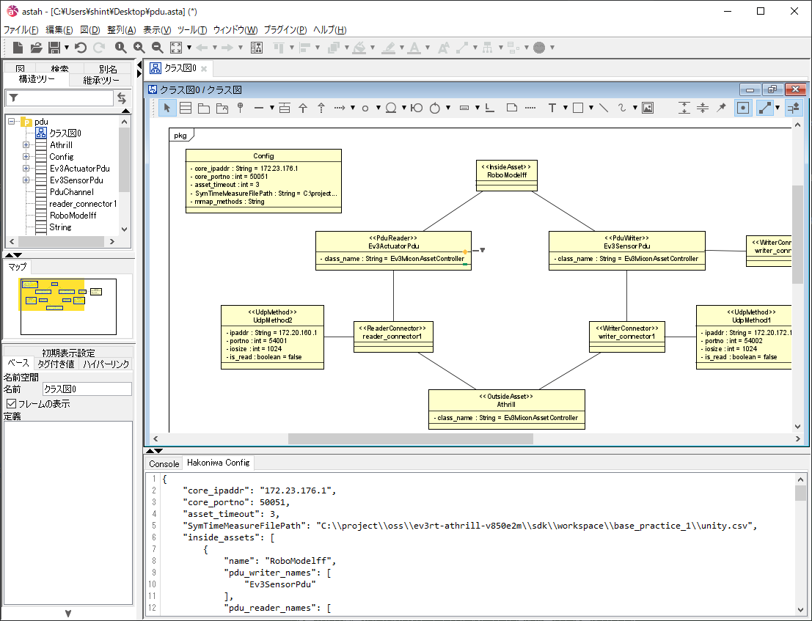

# 概要

箱庭Core(https://github.com/toppers/hakoniwa-core) のシステム構成のJsonファイルをクラス図から生成するastahプラグインです。 拡張ビューに生成したjsonが表示されます。

図の更新やテキストエリアへフォーカスが当たったタイミングでテキストエリアにjsonが自動生成されます。

## インストール方法

ReleaseにあるjarファイルをastahにD＆Dしてインストールし、astah再起動します。

## 利用方法

定義方法は各要素に決められたステレオタイプ、属性と初期値を付与して定義を行います。

### 全体設定

クラス名は”Config”

属性 : 型

- core_ipaddr : String
- core_portno : int
- asset_timeout : int
- SymTimeMeasureFilePath : String
- mmap_methods : String (現在未対応)

### InsideAsset

ステレオタイプ ≪InsideAsset≫\
クラス名がアセット名として定義されます。

### OutsideAsset

ステレオタイプ ≪OutsideAsset≫\
クラス名が識別名、 属性”class_name”の値がUnityで利用するクラスと対応します。

### PduReader / PduWriter

ステレオタイプ ≪PduReader≫ / ≪PduWriter≫\
クラス名が識別名、 属性”class_name”の値がUnityで利用するクラスと対応します。

InsideAssetと関連を結ぶことで、InsideAssetのpdu_reader_names, pdu_writer_namesにも追加されます。

### ReaderConnector / WriterConnector

ステレオタイプ ≪ReaderConnector≫ / ≪WriterConnector≫\
クラス名が識別名となり、 UdpMethod、PDUとの接続関係を元に reader_connectors、writer_connectors、pdu_channel_connectorsの項目を生成します。

### UdpMethod

ステレオタイプ ≪ReaderConnector≫ / ≪WriterConnector≫

属性 : 型

- ipaddr : String
- portno : int
- iosize : int
- is_read : boolean

## サンプル

HakoniwaCore(https://github.com/toppers/hakoniwa-core)
および、sample/sample.astaを参照ください。